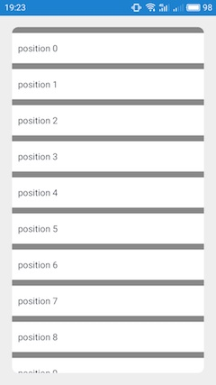
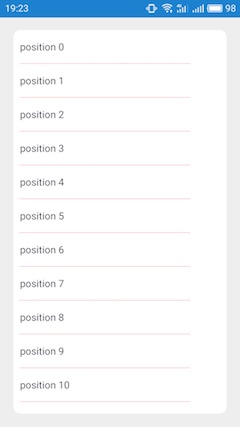
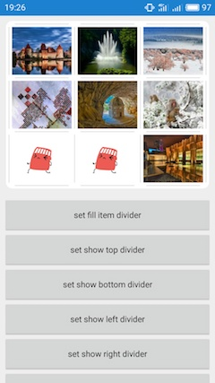
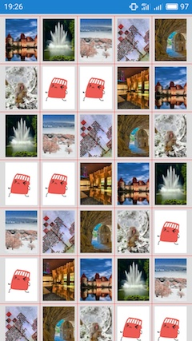
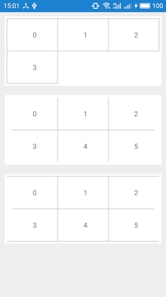

基于 RecyclerView ItemDecoration 实现的分割线和 RecyclerView 圆角背景。

Lastest version: 1.0.3

## Features

Linear divider support vertical and horizontal.

Linear divider can be show the header divider, footer divider, divider margin, and dotted line as well.

Grid divider only support vertical.

Gird divider can be set the spacing between each item, and draw the divider over the spacing zone.

Grid divider can be show the left divider, top divider, right divider, bottom divider, and 4 direction margins as well.

Gird divider is best not to set the dotted line this time, due to bad performance. 

Both linear & grid divider can be set the rounded rectangle, and will not cover those corner radius when scroll the list.

---

Linear divider 支持纵向和横向，可以设置 header divider、footer divider、divider margin、虚线。

Grid divider 只支持纵向，可以设置每个 item 之间的间距，并且它的 divider 是画在这个间距之上的。可以设置 left divider、top divider、right divider、bottom divider、divider margin [left|top|right|bottom]。虚线目前还不能设置上去。

Linear divider 和 grid divider 都可以设置圆角的背景，并且在滑动列表的时候 4 个圆角不会被覆盖。

## Sceenshot

        

        

## Demo download

[app-debug.apk](https://github.com/wordplat/RecyclerViewEasyDivider/releases/download/v1.0.3/app-debug.apk)

## Usage

gradle

```groovy
repositories {
    jcenter()
}

dependencies {
    compile 'com.wordplat:RecyclerViewEasyDivider:1.0.3'
}
```

Linear divider example:

```java
        RecyclerViewCornerRadius cornerRadius = new RecyclerViewCornerRadius(textList);
        cornerRadius.setCornerRadius(AppUtils.dpTopx(mActivity, 10));

        RecyclerViewLinearDivider linearDivider = new RecyclerViewLinearDivider(mActivity, LinearLayoutManager.VERTICAL);
        linearDivider.setDividerSize(2);
        linearDivider.setDividerColor(0xffaa0000);
        linearDivider.setDividerBackgroundColor(0xffffffff);
        linearDivider.setDividerMargin(AppUtils.dpTopx(mActivity, 10), AppUtils.dpTopx(mActivity, 55));

        linearDivider.setShowHeaderDivider(false);
        linearDivider.setShowFooterDivider(false);

        // 设置虚线 这里可以设置虚线，不需要设置 layerType 为 software
        linearDivider.getDividerPaint().setPathEffect(new DashPathEffect(new float[] {4, 4}, 0));
        linearDivider.getDividerPaint().setStyle(Paint.Style.STROKE);

        // 圆角背景必须第一个添加
        textList.addItemDecoration(cornerRadius);
        textList.addItemDecoration(linearDivider);
```

Grid divider example:

If you would like to set left, top, right, bottom divider, additional padding settings in the xml file is need.

如果要设置 left、top、right、bottom divider，需要在 xml 布局文件中额外设置 padding。

```Xml
        android:padding="10dp"
        android:clipToPadding="false"
        android:clipChildren="false"
        android:scrollbarStyle="outsideOverlay"
```


```java
        RecyclerViewCornerRadius cornerRadius = new RecyclerViewCornerRadius(grid3x3List);
        cornerRadius.setCornerRadius(AppUtils.dpTopx(mActivity, 10));
        // 圆角背景必须第一个添加
        grid3x3List.addItemDecoration(cornerRadius);

        // 九宫格列表添加分割线
        final int margin = AppUtils.dpTopx(mActivity, 5);
        final int size = AppUtils.dpTopx(mActivity, 10);
        recyclerViewGridDivider = new RecyclerViewGridDivider(3, size, size);
        recyclerViewGridDivider.setRowDividerMargin(margin * 2, margin * 2);
        recyclerViewGridDivider.setColDividerMargin(margin, margin);
        recyclerViewGridDivider.setShowLeftDivider(false);
        recyclerViewGridDivider.setShowRightDivider(false);
        recyclerViewGridDivider.setDividerClipToPadding(false);
        recyclerViewGridDivider.setDividerSize(1);
        recyclerViewGridDivider.setDividerColor(0x88000000);
        recyclerViewGridDivider.setBackgroundColor(0xffffffff);

        grid3x3List.addItemDecoration(recyclerViewGridDivider);
        // 暂不能设置虚线 缺陷：不适合设置虚线，画虚线需要设置 layerType 为 software，滑动列表时性能低下
```

